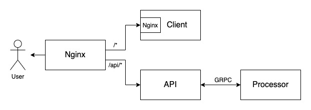

# Computer Vision Service
Currently deployed to http://cvservice-env.eba-qin4ium4.us-east-1.elasticbeanstalk.com

## Table of Contents
1. [About](#1.-about)
2. [Setup](#2.-setup)
3. [Development](#3.-development)
4. [CI/CD](#4.-ci/cd)
5. [Deployment](#5.-deployment)

## 1. About
This monorepo app utilizes computer vision algorithms to extract useful informations from images. As of right now, it primarily uses AWS with additional post processing of results. In the backend, it uses 2 microservices written in GO, on the frontend it uses React. The first microservice is called `API` and is responsible for communication with the frontend and authentication. It accepts requests from `Client` and makes requests to the second microservice, `Processor`, to process data. Communication between the two microservices is implemented via **GRPC** protocol.

The whole app is dockerized and works off of a single command. It is deployed as a multi-container deployment on AWS ElasticBeanstalk. The only container that is exposed directly is the nginx. It is used as a reverse proxy for all the services. /api endpoints are proxied to API container, everything else is proxied to Client container. Processor is not accessible from the outside - only within the application.

The following diagram represents overall architecture of this project:


As of right now, only one major features was implemented - extracting entites from images and preparing them for downloading. Here is how it works:
1. Client makes a request to API to upload a file (`POST /upload`)
2. API uploads data to s3 bucket and returns bucket and key
3. UI uses the bucket and the key to make a second request to API to extract entities (`POST /recognitions`)
4. API calls GRPC method to process the image
5. Processor downloads the image, calls AWS to extract entities, and extracts + uploads new images based on the AWS results. The last step is done in-parallel, via go routines. After that, Processor returns resulting bucket + key pairs to API
6. API sends results to Client

## 2. Setup and Run
Ensure that you have docker cli installed, clone the repo, and run from the root directory:

```bash
docker-compose up --build
```

It will install all the required images and run the containers. When it's finished, go to `http://localhost:8080`. API is accessible via `http://localhost:8080/api`.

To use the app, you need AWS credentials to access S3 and Rekognition services. Add `.env` file in both API and Processor folders.

```bash
AWS_ACCESS_KEY=your-access-key
AWS_SECRET_KEY=your-secret-key
```

These variables are set automatically in deployment environment.


## 3. Development Notes
Docker definitions are stored in Dockerfile.dev files in each folder. 
This project uses hot reloading and docker volumes in all containers (Client, API, and Processor). Whenever there is any change in source file, the corresponding docker restarts.

To generate code according to proto file, install software according to https://github.com/golang/protobuf and run
```bash
protoc -I ./ ./cvservice.proto --go_out=plugins=grpc:.
```

## 4. CI/CD
This app uses Travis CI to manage CI/CD. Every time master branch receives an update, Travis picks it up, runs tests, and deploys it to AWS ElasticBeanstalk

## 5. Deployment
This app is deployed to AWS ElasticBeanstalk as a multi-container application. Dockerrun.aws.json contains configurations for the current deployment, including per-container hardware requirements. To deploy a new version, just push your updates to master branch.